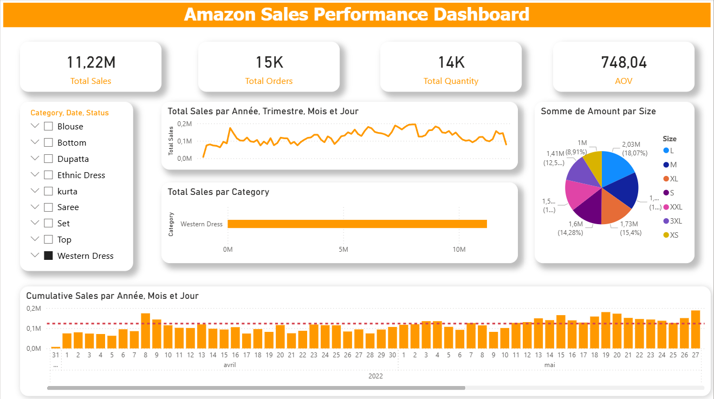

# Dashboard des ventes Amazon – Projet Power BI

## Présentation du projet

Ce projet consiste en la réalisation d’un dashboard interactif sous Power BI permettant d’analyser les performances commerciales d’Amazon.

L’objectif est de transformer des données brutes en indicateurs clés et en insights exploitables pour la prise de décision.

---

## Outils et compétences mobilisés

* Power BI
* Power Query (nettoyage des données)
* DAX (mesures et indicateurs)
* Data visualisation
* Analyse de données

---

## Données utilisées

* Source : Amazon Sales Report
* Contenu : informations sur les commandes, produits, quantités, catégories et chiffre d’affaires

---

## Préparation des données

Les données ont été nettoyées et transformées dans Power Query :

* Conversion des types de données (dates, nombres)
* Gestion des valeurs manquantes et incohérentes
* Standardisation des colonnes

---

## Fonctionnalités du dashboard

### Indicateurs clés (KPI)

* Chiffre d’affaires total
* Nombre de commandes
* Quantité vendue
* Panier moyen

### Analyses réalisées

* Évolution du chiffre d’affaires dans le temps
* Répartition des ventes par catégorie
* Identification des produits les plus performants

---

## Indicateurs avancés

* Taux de croissance des ventes (%)
* Chiffre d’affaires cumulé
* Contribution des catégories (%)

---

## Aperçu du dashboard

---

## Principaux insights

* Une minorité de catégories génère la majorité du chiffre d’affaires
* Les ventes varient significativement selon les périodes
* Certains produits contribuent fortement à la performance globale

---

## Apports du projet

Ce projet démontre la capacité à :

* Nettoyer et structurer des données brutes
* Concevoir un dashboard orienté métier
* Produire des analyses pertinentes pour la prise de décision

---

## Contact

N’hésitez pas à me contacter pour toute question ou retour sur ce projet.
